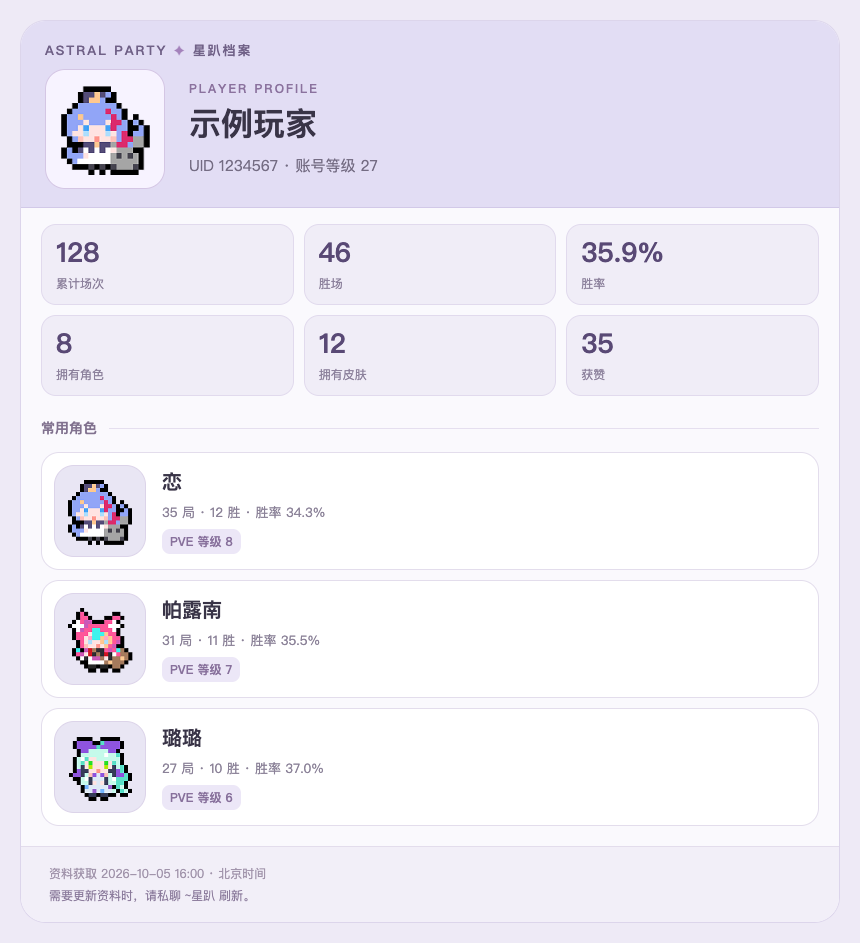
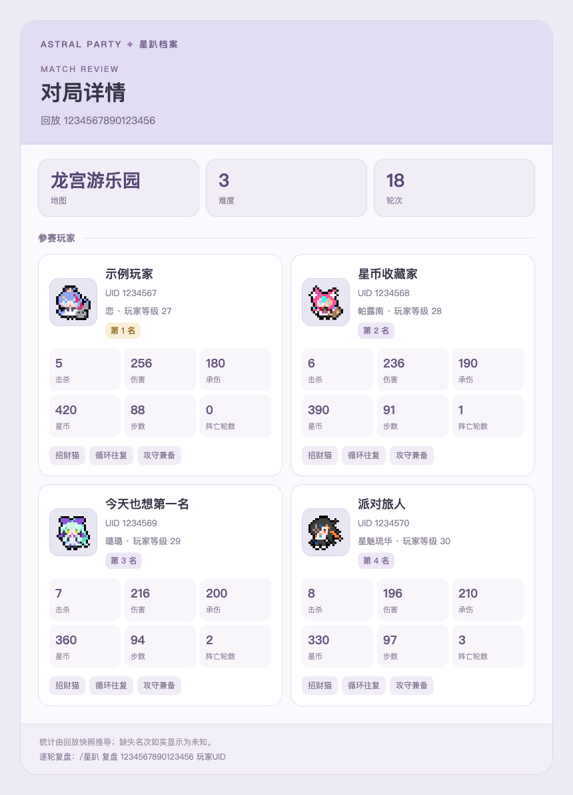
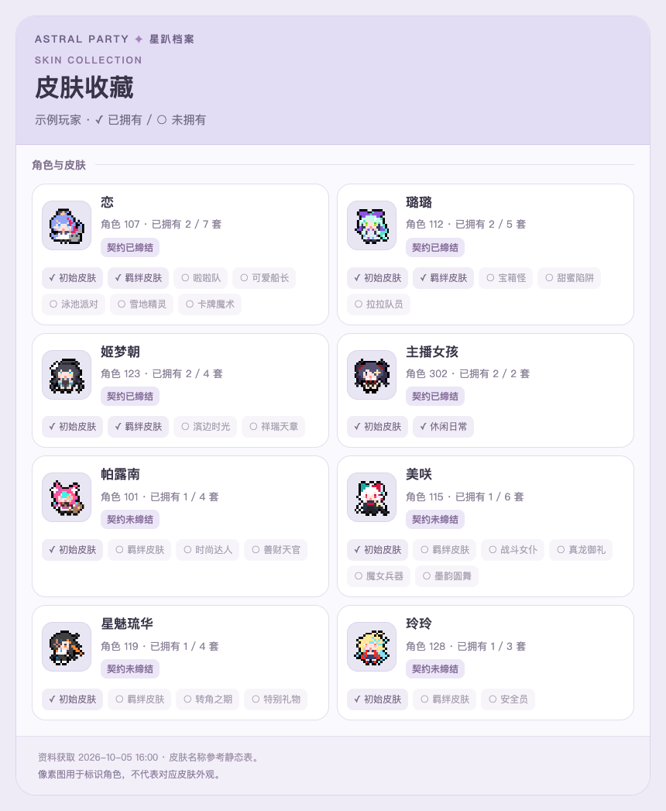
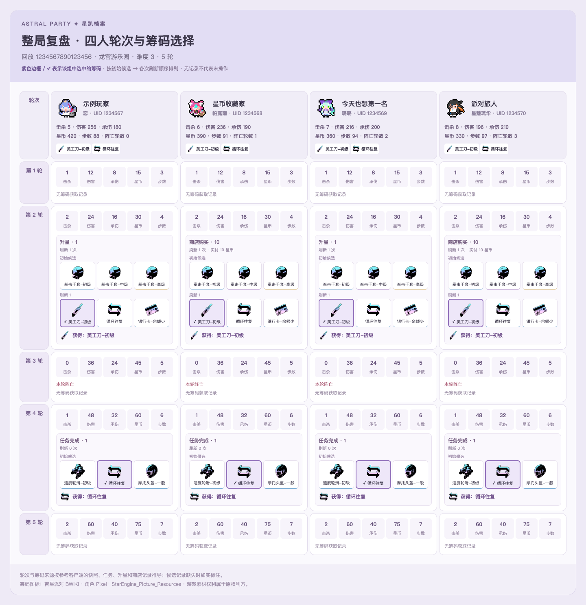

# 星趴档案助手 · AstrBot 插件

让聊天用户绑定《吉星派对 / Astral Party》国服账号，查询个人档案、近期战绩、角色皮肤和逐轮复盘。

参考 [ZtyanCrany/AstralParty_Dex](https://github.com/ZtyanCrany/AstralParty_Dex)，重写了服务器环境所需的异步登录、TCP 客户端、多用户存储和聊天交互。当前移植基于上游提交 `35b8e69`。

## 安装

在 AstrBot 管理面板的插件页，通过仓库地址安装：

```text
https://github.com/LoraenKonpeki/astrbot_plugin_astralparty_dex
```

需要 Python 3.10+、AstrBot 4.3.2+（4.x），依赖由 `requirements.txt` 声明。服务器应能访问国服 SDK、游戏 TCP 服务和回放服务器。无需在服务器安装游戏、桌面窗口或 Unity 资源提取库。

修改或更新插件后使用 AstrBot 的插件重载功能，无需重启整个服务。

## 快速使用

1. **私聊机器人**发送 `~星趴 登录 你的手机号`。
2. 收到短信后，私聊发送 `~星趴 验证 你的验证码`。
3. 使用 `~星趴 我的`、`~星趴 战绩` 查询。绑定在同平台、同机器人实例的群聊和私聊之间共享。
4. 玩完游戏后，如需更新自己的资料，**私聊**发送 `~星趴 刷新`。

**游戏账号可能只允许一处会话在线。登录或刷新可能让正在运行的游戏客户端下线，请先退出游戏。** 插件遇到在线账号冲突不会自动重试接管；第一次握手本身是否使旧会话下线由游戏服务器决定。

群聊中的登录、验证码、刷新、解绑请求会被明确拒绝，并提示用户私聊。私聊限制判断在参数验证、短信发送和登录调用之前执行，缺少或错误参数也不会绕过检查。

## 帮助与指令

- `~星趴` 或 `~星趴 帮助`：总帮助。
- `~星趴 帮助 指令名`：详细说明，例如 `~星趴 帮助 登录`。
- `~星趴 指令名 帮助`：相同的详细说明，例如 `~星趴 复盘 帮助`。
- 英文根指令别名为 `~astralparty`，子指令仍使用中文。

| 指令 | 用途 | 限制 |
| --- | --- | --- |
| `~星趴 登录 手机号` | 发送短信验证码 | 仅私聊；中国大陆手机号；用户和手机号各冷却 60 秒 |
| `~星趴 验证 验证码` | 登录并绑定 | 仅私聊；流程有效期 5 分钟；最多尝试 5 次 |
| `~星趴 状态` | 查看绑定、凭据保存和连接状态 | 不发起游戏登录 |
| `~星趴 刷新` | 获取自己的最新资料和战绩 | 仅私聊；冷却 30 秒；可能挤掉游戏客户端 |
| `~星趴 解绑` | 删除当前用户的本地凭据并断开连接 | 仅私聊；不删除游戏账号 |
| `~星趴 我的` | 个人档案、累计场次、胜场、胜率和获赞 | 需要绑定 |
| `~星趴 战绩 [UID或我的]` | 最近最多 10 局，默认自己 | 全部记录合并为一张图；UID 查询需要自己的登录态 |
| `~星趴 对局 回放号或序号` | 单局玩家与战况统计 | 直接按回放号无需绑定 |
| `~星趴 复盘 回放号或序号` | 整局四人逐轮战况、筹码来源、候选刷新链和选择 | 全部轮次合并为一张图；直接按回放号无需绑定 |
| `~星趴 角色` | 自己的角色使用排行、PVE 等级和潜能 | 全部已拥有角色 |
| `~星趴 皮肤 [角色名或角色ID]` | 自己的皮肤与契约状态 | 全部已拥有角色；可按角色筛选 |

完整的逐指令帮助见 [docs/COMMANDS.md](docs/COMMANDS.md)，内容与插件内帮助一致。

示例：

```text
~星趴 战绩
~星趴 战绩 我的
~星趴 战绩 1234567
~星趴 对局 1
~星趴 对局 1234567890123456
~星趴 复盘 1
~星趴 角色
~星趴 皮肤 101
~星趴 皮肤 帕露南
```

战绩序号按“用户 + 当前群/私聊”隔离，有效期 10 分钟，序号从 1 开始连续排列。查询另一位玩家后，序号对应这次新列表。皮肤指令中的数字统一作为角色 ID；不再接受页码参数。

## 展示与数据行为

- 个人资料、战绩、角色、皮肤、单局详情和逐轮复盘默认使用 AstrBot HTML 渲染生成图片。失败时回退文字；可关闭 `image_cards`。服务器渲染环境应具有中文字体，例如 Noto Sans CJK。
- 总帮助、详细帮助和登录反馈使用文字；长消息按长度拆分发送。
- 自己的资料来自游戏登录握手包，普通查询复用快照并显示获取时间，避免连续登录。需要新数据时主动私聊刷新。
- 查询其他 UID 使用自己的登录会话，单用户请求串行，外部 UID 查询冷却 3 秒，全局并发上限 4。
- 游戏连接有心跳，默认闲置 180 秒关闭，断线不会无限重试。登录失败后需用户主动刷新或重新登录。
- 对局统计由回放快照推导。名次在当前战绩列表含对应玩家数据时显示，否则标为未知，不推测。
- 角色、皮肤、地图、潜能和筹码名称来自附带的静态数据表，可能落后于游戏更新。未知内容用编号或“未知”表示。
- 第一版未实现 Steam、B站、TapTap 本机日志/进程读取登录方式；也未实现自动战绩推送。

## 凭据与数据目录

若已安装旧名称版本，迁移时需将旧的 `data/plugin_data/astrbot_plugin_astralparty/` 整个目录复制到新数据目录，包含加密密钥；停用旧插件后启用新版。

所有运行数据放在 AstrBot 的 `data/plugin_data/astrbot_plugin_astralparty_dex/`，更新插件不会覆盖账号数据：

```text
credentials.key       # 自动生成的加密密钥，权限 0600
accounts/*.enc        # 每用户加密保存的 token、UID、昵称、更新时间
sms_limits.json       # 用户标识/手机号哈希对应的冷却时间
replays/*.bin         # 公共回放缓存
```

绑定标识由平台类型、平台实例 ID、机器人 ID、发送者 ID 共同计算，不包含群号。不会自动共享不同平台或机器人实例的凭据。

插件不长期保存手机号、验证码、游戏 SID 或 SDK 原始响应；手机号和待验证流程仅临时存在内存中，超时、解绑或插件关闭后清除。登录凭据更新采用原子文件替换，令牌轮换后会先保存新令牌再建立游戏连接。

加密密钥与账号文件位于同一服务器，加密不能防止服务器管理员或具有整个数据目录读取权限的人获取登录态。备份账号时需要连同密钥保存，请勿上传该目录。不要同时让多个插件进程共享这一数据目录。

所有指令（包括拒绝的群聊登录）停止后续事件传播；插件日志不输出原始凭据或异常正文。不过消息平台、AstrBot 自身日志和其他先执行的插件仍可能留存消息，因此应避免群内发送手机号或验证码，管理员也应配置适当的消息日志保留策略。

所有示例使用机器人的 `~` 唤醒前缀；指令注册交由 AstrBot 按其前缀配置识别。

## 图片卡片

卡片使用本地内置的 32 个 Pixel 角色小人，并按角色 ID 显示在资料、战绩、角色列表、皮肤列表、单局和逐轮复盘中。采用分区统计、角色卡片和紧凑双列布局，一次查询完整输出一张图片，不截断角色、皮肤、战绩或复盘轮次，未知角色显示占位图；皮肤列表中的小人表示角色，不代表该皮肤的外观。素材原路径、版本和校验值见 [来源清单](assets/pixel/source.json)。

下面为合成数据预览，并非真实账号记录。









开发预览使用合成数据：`python scripts/preview_cards.py`，生成的 HTML 位于 `output/playwright/`。

## 配置

| 配置项 | 默认值 | 说明 |
| --- | --- | --- |
| `image_cards` | `true` | 图片卡片，失败时回退文字 |
| `game_host` | `101.132.186.71` | 上游当前使用的国服 TCP 主机 |
| `game_port` | `8800` | 游戏服务端口 |
| `client_version` | `3.2.0` | 上游使用的协议版本，更新需同时核对描述符 |
| `request_timeout` | `20` | 请求超时秒数，5～60 |
| `session_idle_seconds` | `180` | 闲置连接关闭秒数，30～1800 |
| `max_sessions` | `20` | 同时保留的连接数，1～100；优先淘汰无请求的连接 |
| `max_replay_mb` | `16` | 单回放上限，1～64 MB |
| `cache_mb` | `200` | 公共回放缓存上限，32～2048 MB |
| `cache_days` | `7` | 回放缓存保留天数，1～30 |

回放只从固定回放服务器下载，用户输入必须为数字回放号，禁止重定向；流式下载也会检查文件大小。解析由单个后台工作线程执行，同一回放缓存复用，避免阻塞消息处理。

## 开发与验证

```bash
python -m pip install -r requirements-dev.txt
ruff check .
ruff format --check .
python -m pytest -q
```

测试覆盖群聊拒绝且不触发服务调用、总帮助与所有逐指令帮助、加密与用户隔离、验证码冷却/过期/次数、令牌轮换、真实本地 TCP 分片收发/超时/在线冲突、模拟 SDK HTTP 签名与分块响应、回放下载缓存与大小限制、合成 Protobuf 回放、资料解析、图片失败回退及事件停止传播。

测试使用本地模拟服务与合成回放。SDK 初始化签名已通过线上服务验证（不涉及手机号或用户登录凭据）；**尚未使用真实账号验证短信、国服登录和游戏实战回放，也未完成 QQ 平台现场联调**。上游协议来自客户端分析，游戏更新可能需要适配；安装后请先私聊检查 `~星趴 帮助` 和登录流程。

协议资料包的核验结果和采用的规则见 [RPC 交接资料学习记录](docs/RPC_HANDOFF_NOTES.md)。

## 来源与许可

插件采用 MIT 许可，详见 [LICENSE](LICENSE)。协议编解码、描述符加载、回放/复盘解析、角色皮肤解析、静态表及 SDK 签名常量移植或参考了 [AstralParty_Dex](https://github.com/ZtyanCrany/AstralParty_Dex)，保留上游作者 Nemophila & ZtyanCrany 的许可，见 [licenses/AstralParty_Dex-MIT.txt](licenses/AstralParty_Dex-MIT.txt)。

本插件与游戏开发方、运营方无关联。游戏协议、名称和数据的相关权利属于原权利方；像素角色素材来自用户指定的 [StarEngine_Picture_Resources](https://github.com/LoraenKonpeki/StarEngine_Picture_Resources)，素材权利属于原权利方，不因插件代码采用 MIT 而改变。附带的签名常量来自上游公开项目，不是用户登录凭据。请遵循上游的学习研究用途说明，避免商业用途与大规模数据抓取。

整局复盘只需要 `~星趴 复盘 回放号`，按轮次 × 玩家并排展示全局。沿用参考客户端的事件轮次归属、刷新链和最终选择标记，不把刷新前出现的同名筹码误标为已选。候选或统计缺失时会标明，不据此推断没有操作。

筹码图标来自 [吉星派对 BWIKI 筹码页](https://wiki.biligame.com/starengine/筹码)，本地内置并按 ID/页面名称核对映射；当前附带筹码表中的 89 项全部有对应图标。原文件名、下载地址和 SHA-256 见 [筹码来源清单](assets/chips/source.json)。素材权利属于原权利方，插件代码的 MIT 不适用于游戏美术。未知筹码保留名称/编号占位，渲染无需访问外部图片服务器。
